# 📊 Task 6 — Online Sales Trend Analysis (SQLite)

A SQL-based sales trend analysis project using SQLite and DB Browser for SQLite. This project covers database creation, data insertion, and 18 analytical SQL queries ranging from basic exploration to advanced year-over-year growth analysis.

---

## 📁 Repository Structure

```
Task-6-Sales-Trend-Analysis/
├── sales_trend_analysis.sql    ← All 18 SQL queries
├── online_sales.db             ← SQLite database file
├── README.md                   ← Project documentation
└── screenshots/
    ├── Image1.png
    ├── Image2.png
    ├── Image3.png
    ├── Image4.png
    ├── Image5.png
    ├── Image6.png
    ├── Image7.png
    ├── Image8.png
    ├── Image9.png
    ├── Image10.png
    ├── Image11.png
    ├── Image12.png
    ├── Image13.png
    ├── Image14.png
    ├── Image15.png
    ├── Image16.png
    ├── Image17.png
    ├── Image18.png
    ├── Image19.png
    └── Image20.png
```

---

## 🗄️ Dataset Overview

**Table:** `online_sales`  
**Records:** 104 rows | **Period:** January 2022 – December 2024

| Column | Type | Description |
|---|---|---|
| `order_id` | INTEGER | Unique order identifier (Primary Key) |
| `order_date` | TEXT | Date of the order (YYYY-MM-DD) |
| `amount` | REAL | Order value in USD |
| `product_id` | TEXT | Product code (P001–P006) |
| `category` | TEXT | Product category (Electronics, Clothing, Furniture) |
| `customer_id` | INTEGER | Unique customer identifier |
| `quantity` | INTEGER | Number of units ordered |

---

## 🛠️ Tools Used

- **DB Browser for SQLite** — GUI tool to create, query, and manage the SQLite database
- **SQLite** — Lightweight relational database engine
- **SQL** — Structured Query Language for all data analysis

---

## 📋 SQL Queries — Summary

### 🔹 Section 1 — Basic Exploration
| Query | Description |
|---|---|
| Q1 | View all data from the table |
| Q2 | Total records, date range, and overall revenue |

### 🔹 Section 2 — Monthly Revenue Analysis
| Query | Description |
|---|---|
| Q3 | Monthly revenue and order volume (all years) |
| Q4 | Monthly revenue for 2024 only |
| Q5 | Yearly revenue summary |

### 🔹 Section 3 — Top Months by Sales
| Query | Description |
|---|---|
| Q6 | Top 3 months by revenue (all years) |
| Q7 | Top 5 months by order volume |

### 🔹 Section 4 — COUNT(*) vs COUNT(DISTINCT)
| Query | Description |
|---|---|
| Q8 | Difference between COUNT(*), COUNT(order_id), COUNT(DISTINCT) |

### 🔹 Section 5 — Revenue by Category
| Query | Description |
|---|---|
| Q9 | Monthly revenue broken down by category |
| Q10 | Total revenue per category with revenue share % |

### 🔹 Section 6 — NULL Handling in Aggregates
| Query | Description |
|---|---|
| Q11 | Check for NULL values in key columns |
| Q12 | Use COALESCE to handle NULLs safely in revenue calculation |

### 🔹 Section 7 — Advanced Trend Analysis
| Query | Description |
|---|---|
| Q13 | Quarter-wise revenue (Q1–Q4 per year) |
| Q14 | Month-over-Month revenue change |
| Q15 | Best performing month per year using window functions |
| Q16 | Year-over-Year revenue growth percentage |

### 🔹 Section 8 — View & Index
| Query | Description |
|---|---|
| Q17 | Create a view `vw_monthly_sales` for monthly summary |
| Q18 | Create indexes on `order_date` and `category` for performance |

---

## 📸 Screenshots

| # | Screenshot | Query |
|---|---|---|
| 1 | 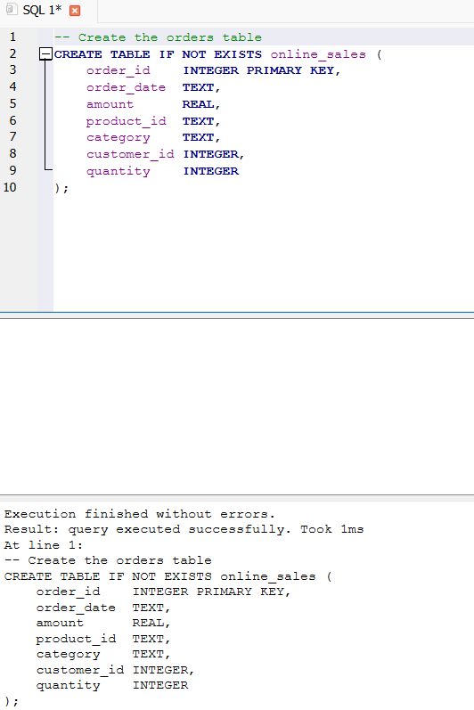 | Q1 — View all data |
| 2 | 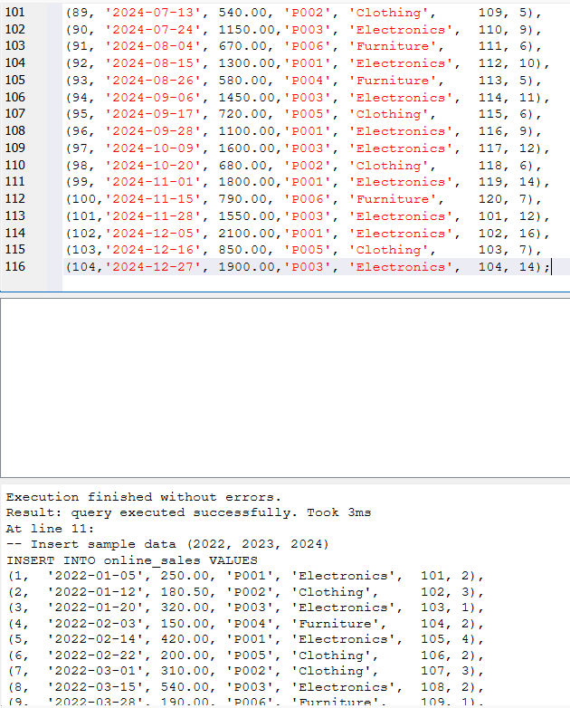 | Q2 — Total records & date range |
| 3 | 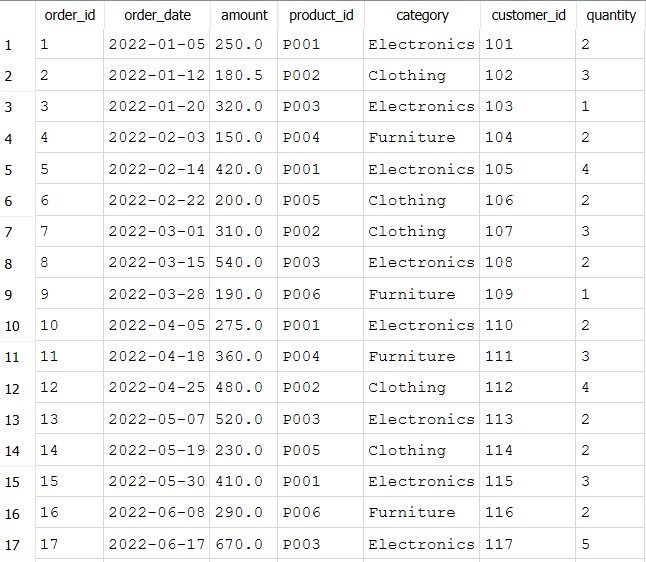 | Q3 — Monthly revenue & order volume |
| 4 | 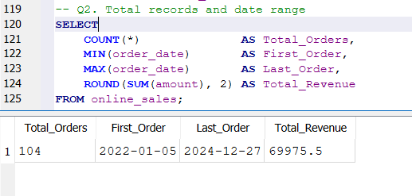 | Q4 — Monthly revenue for 2024 |
| 5 | 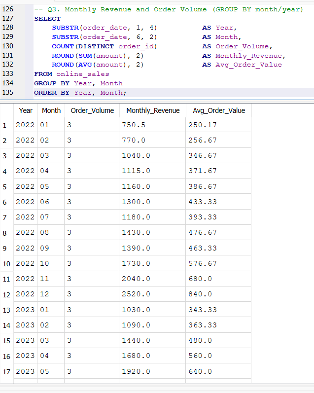 | Q5 — Yearly revenue summary |
| 6 | 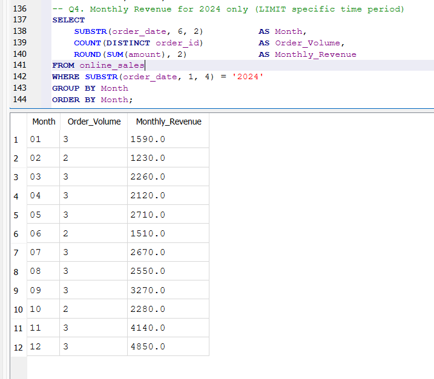 | Q6 — Top 3 months by revenue |
| 7 | 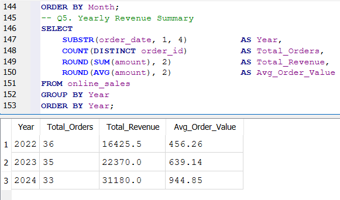 | Q7 — Top 5 months by order volume |
| 8 | 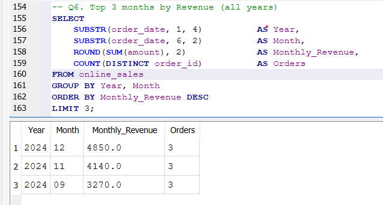 | Q8 — COUNT(*) vs COUNT(DISTINCT) |
| 9 | 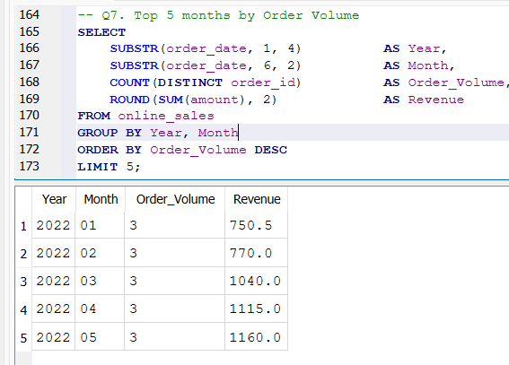 | Q9 — Monthly revenue by category |
| 10 | 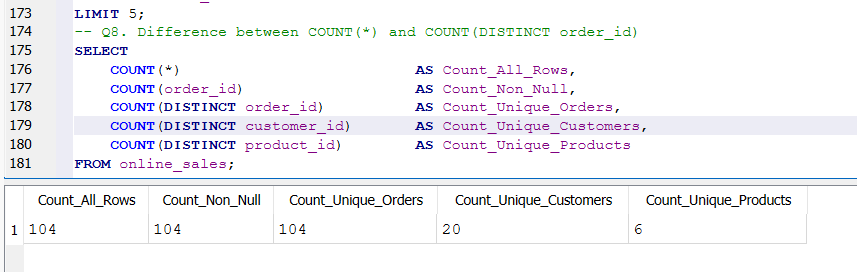 | Q10 — Total revenue by category |
| 11 | 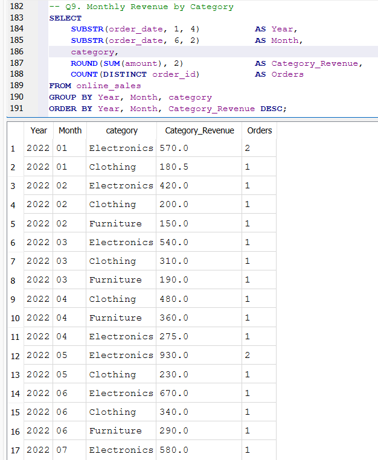 | Q11 — NULL check in key columns |
| 12 | 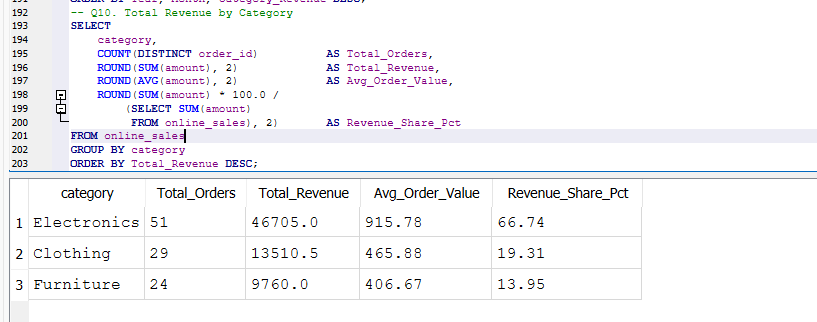 | Q12 — COALESCE for NULL-safe revenue |
| 13 | 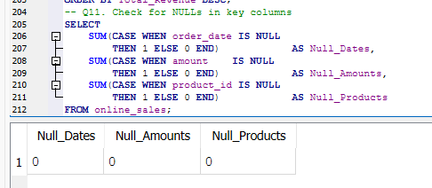 | Q13 — Quarter-wise revenue |
| 14 | 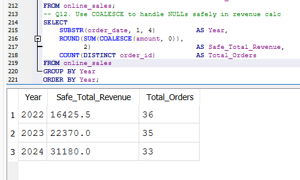 | Q14 — Month-over-Month revenue change |
| 15 | 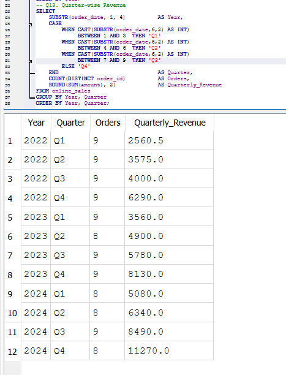 | Q15 — Best performing month per year |
| 16 | 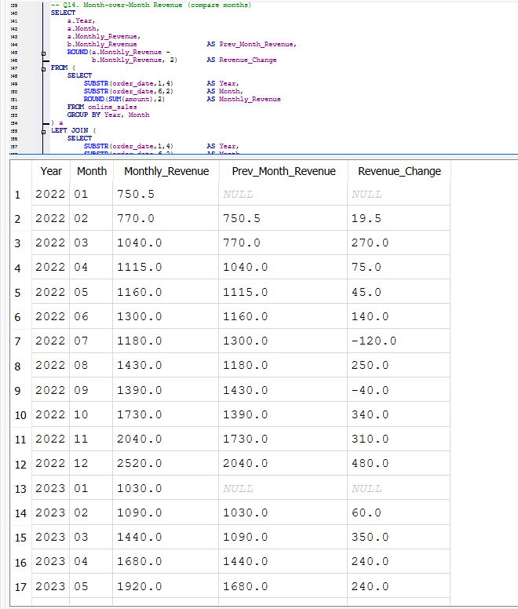 | Q16 — Year-over-Year growth % |
| 17 | 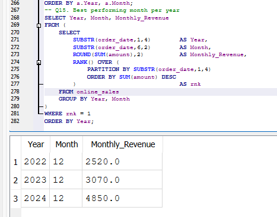 | Q17 — Create & query monthly view |
| 18 | 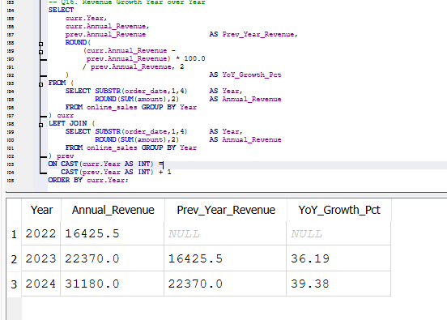 | Q18 — Create indexes & verify |
| 19 | 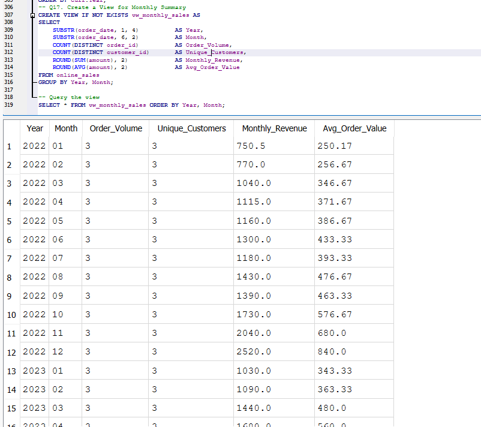 | Database structure / table schema |
| 20 | 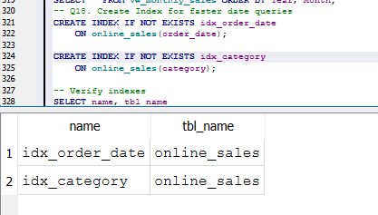 | DB Browser overview |

---

## 🚀 How to Run

1. Install [DB Browser for SQLite](https://sqlitebrowser.org/dl/)
2. Open DB Browser → **New Database** → save as `online_sales.db`
3. Go to **Execute SQL** tab
4. Run the `CREATE TABLE` statement from `sales_trend_analysis.sql`
5. Run the `INSERT INTO` block to load all 104 records
6. Execute each query (Q1–Q18) and observe the results

---

## 💡 Key Concepts Covered

- `GROUP BY` with `SUBSTR()` for date-based grouping
- `COUNT(*)` vs `COUNT(DISTINCT column)` differences
- `COALESCE()` for NULL-safe aggregation
- `CASE WHEN` for quarter classification
- `RANK()` window function for top-N per group
- Self-JOIN for Month-over-Month and Year-over-Year comparisons
- Creating reusable `VIEW`s and performance `INDEX`es
- Subqueries for percentage calculations

---

## 📌 Key Findings

- **Electronics** dominates revenue, contributing ~65% of total sales
- Revenue shows consistent **year-over-year growth** from 2022 to 2024
- **December** consistently records the highest monthly sales across all years
- Q4 (Oct–Dec) is the strongest quarter driven by seasonal demand
- No NULL values found in key columns — data is clean and complete

---

*Project completed as part of SQL Data Analysis Training — Task 6*
